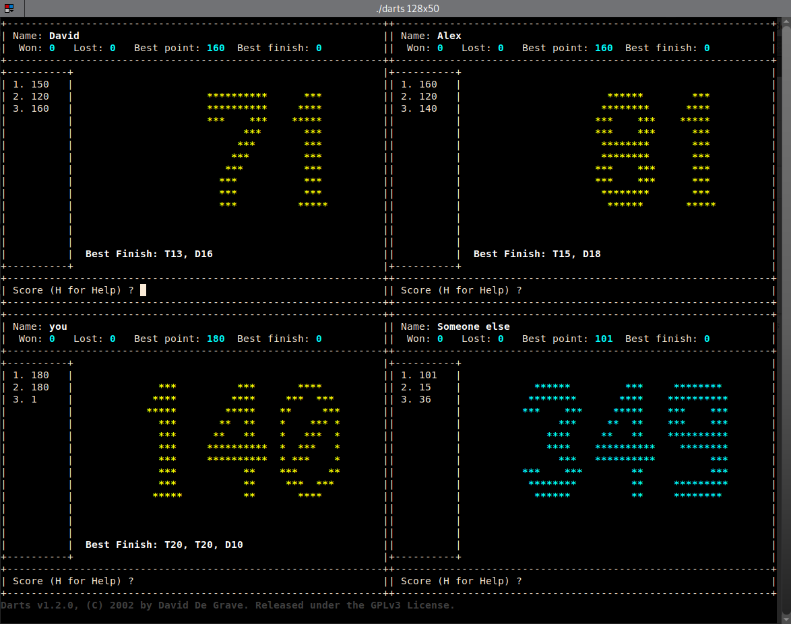

# DARTS v1.2.0

Copyright (C) 2002 David De Grave <david@ledav.net>

Released under the GNU GENERAL PUBLIC LICENSE Version 3, 29 June 2007

This a dashboard designed for darts players.  Very useful to show your
actual points while keeping trace of your previous shots.  Depending on the
mode chosen (pro or beginner) it shows you also the best finish when needed.

Designed to run in console (ncurses) with dimensions of at least 128x50.
Numbers are shown in squares of 10x12 so that it can be seen by players
while playing.

Have fun !  :-)

